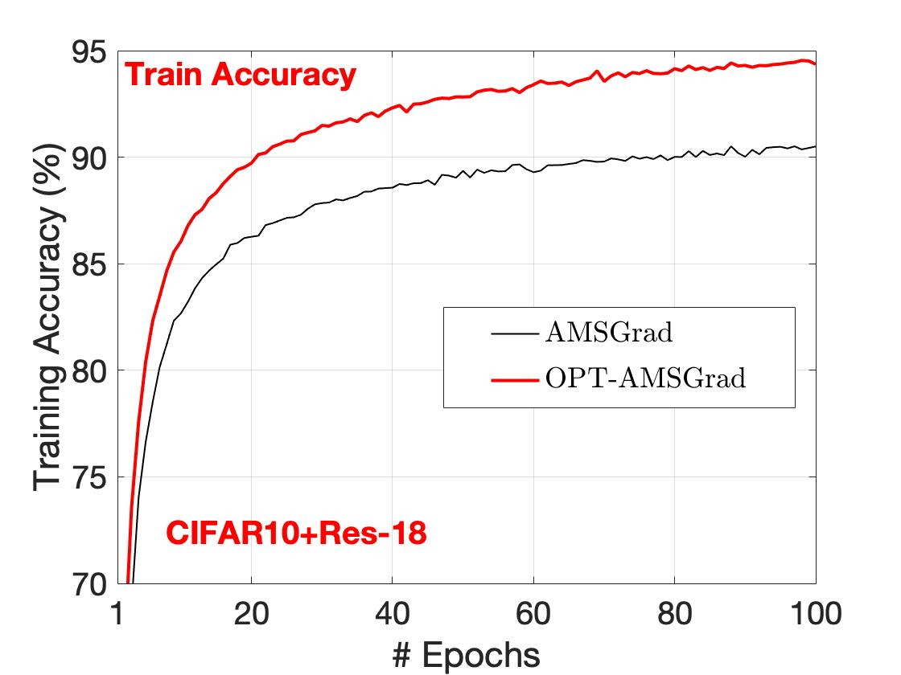
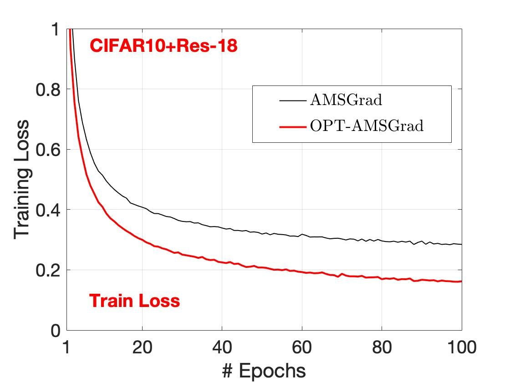
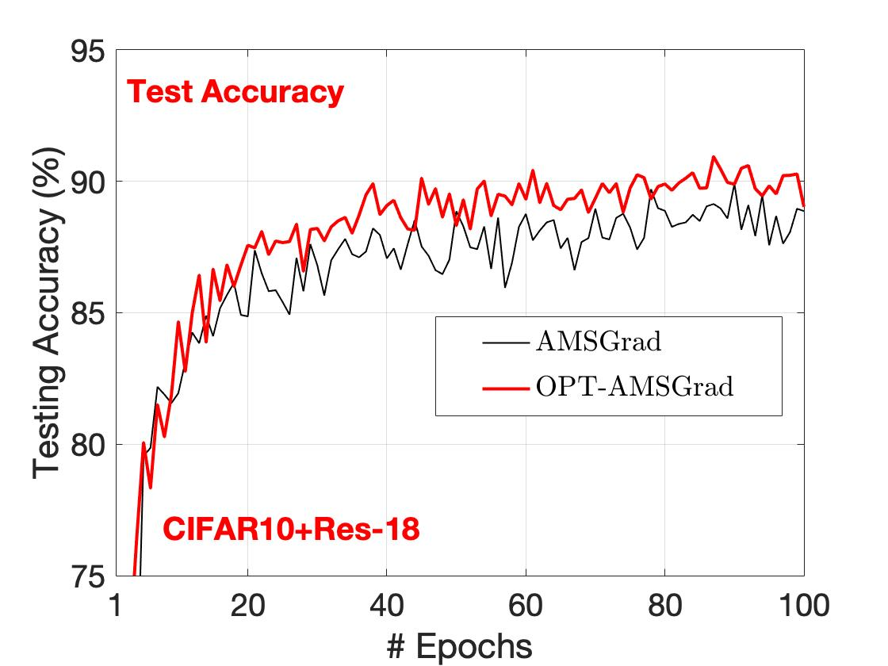
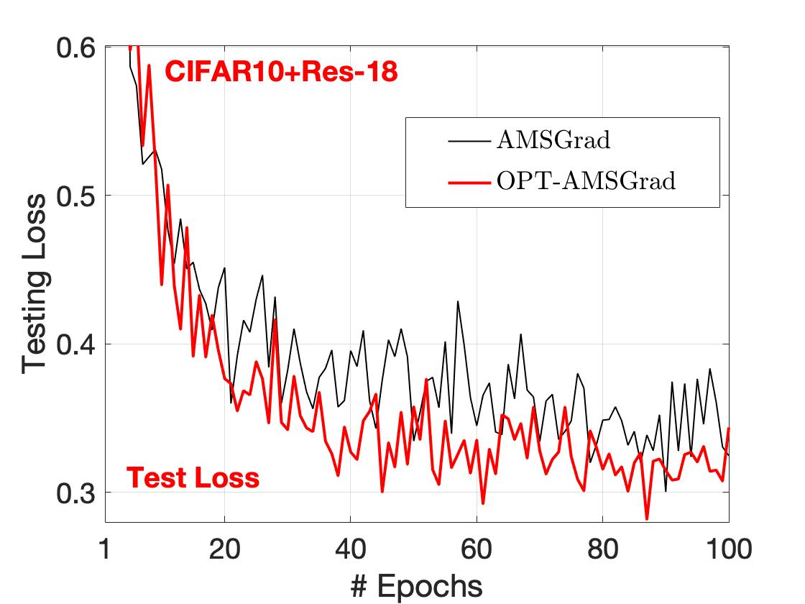
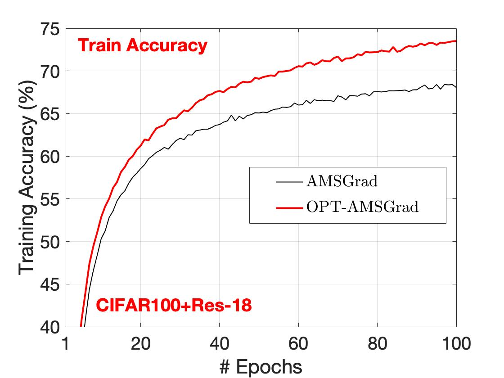
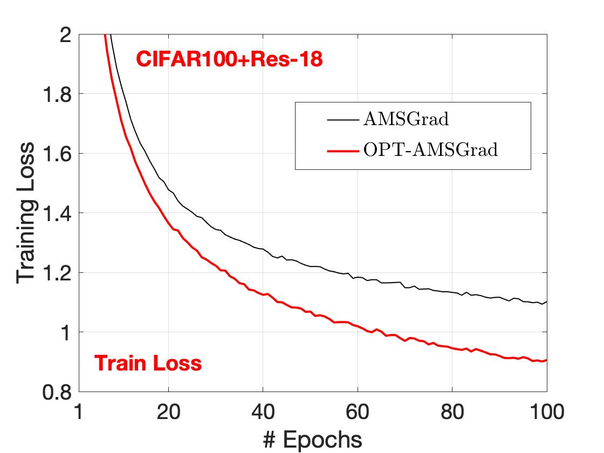
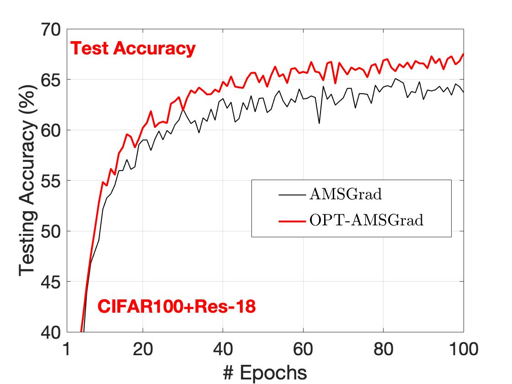
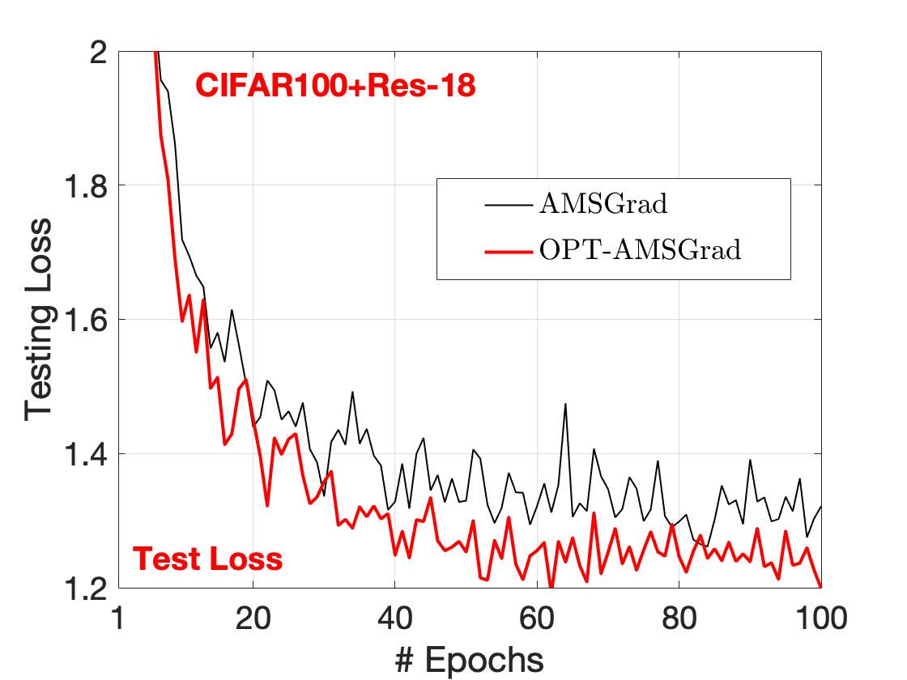

# optimistic_amsgrad

This repository contains the scripts and codes to reproduce the experimets in [the paper](https://arxiv.org/pdf/1903.01435.pdf):
```
Optimistic Adaptive Acceleration for Optimization.
Jun-Kun Wang, Xiaoyun Li, and Ping Li. arXiv:1903.01435, 2019.
```

We propose [Optimistic-AMSGrad](https://arxiv.org/pdf/1903.01435.pdf), a new algorithm for training deep neural nets. 
The experiments were conducted on
- CIFAR 10   + Res18 
- CIFAR 100  + Res18 
- Two MNIST datasets corrupted by some noise + a four-layer conv-net. The data can be downloaded from this link [https://www.dropbox.com/sh/afuj32008ahmjc9/AAAhX05rQG42OpB_u36cVV6fa?dl=0](https://www.dropbox.com/sh/afuj32008ahmjc9/AAAhX05rQG42OpB_u36cVV6fa?dl=0)

[Optimistic-AMSGrad](https://arxiv.org/pdf/1903.01435.pdf) significantly improves [AMSGrad](https://openreview.net/pdf?id=ryQu7f-RZ) in terms of all the following measures:
cross entropy loss on training data, cross entropy loss on testing data, classification accuracy on training 
data, and classification accuracy on testing data.

In all the experiments, we use the same set of hyper-parameters
* step size \eta = 0.001
* \beta_1 = 0.9
* \beta_2 = 0.99
* number of training samples in each batch: batch_size=64  
* (Optimistic-AMSGrad) number of previous iterates stored for gradient prediction: span=5 
(i.e. span=5 means the latest five iterates are used for gradient prediction) 

Please see *experiment.txt* for replicating the results. In the directory *figures/*, we provide codes to plot the following figures.

<hr>

### CIFAR10 + Res18 results


<p float="left">
  
   
</p>

<p float="left">
  
   
</p>

### CIFAR100 + Res18 results

<p float="left">
  
   
</p>

<p float="left">
  
   
</p>

### MNIST-back-rand noisy dataset results

<p float="left">
  
   
</p>

<p float="left">
  
   
</p>


### MNIST-back-img noisy dataset results

<p float="left">
  
   
</p>

<p float="left">
  
   
</p>


